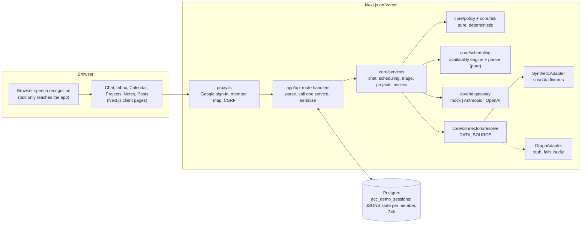
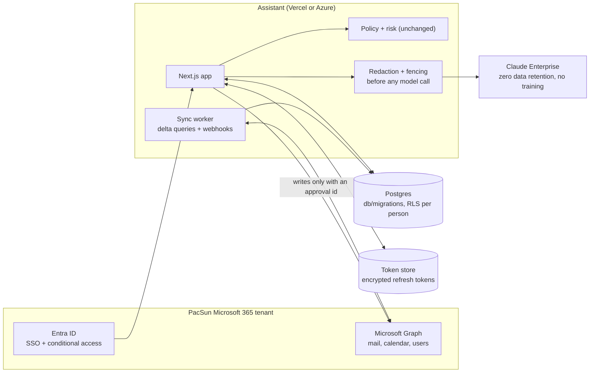

# Architecture: today and the path to a real backend

This document describes how the PacSun Executive Assistant prototype is built,
what a production version connected to Office 365 would look like, and what
has to be true before real executive data could flow through it. It is written
for the client's technology team, the course reviewers, and engineers picking
up the code.

The claim the whole design protects:

> The AI analyzes and proposes. Authentication, deterministic policy, and human
> confirmation control every consequential action.

## 1. As-is: the prototype



What is true today:

- **All data is synthetic.** Directory, mailbox, calendars, documents, and
  projects live in `src/data`. No real executive, customer, or company data is
  in the repository.
- **State is per signed-in member.** Each member's session (assessments,
  approvals, bookings, sent replies, projects) is one JSONB row in Postgres,
  locked for the duration of a request and expired after 24 hours.
- **The model never decides.** It may classify a question's topic or extract
  the fields of a meeting request. Every name it returns is re-resolved against
  the directory, and `evaluatePolicy()` decides what may happen.
- **Nothing leaves the demo.** Booking writes to synthetic calendars; sending
  writes to a synthetic Sent folder; posts are exported as text.

## 2. To-be: connected to Office 365 and Claude Enterprise



The application layers do not change. `DATA_SOURCE=graph` swaps the
SyntheticAdapter for Graph connectors that implement the same three interfaces
in `src/core/connectors/index.ts`. The stub in `src/core/connectors/graph.ts`
already names the Graph call and scope behind each method.

## 3. Microsoft Graph integration plan

| Capability | Graph call | Delegated scope |
|---|---|---|
| Read the executive's mail | `GET /me/messages` (delta) | `Mail.Read` |
| Draft a reply | `POST /me/messages/{id}/createReply` | `Mail.ReadWrite` |
| Send a draft | `POST /me/messages/{id}/send` | `Mail.Send` |
| Free/busy for colleagues | `POST /me/calendar/getSchedule` | `Calendars.Read.Shared` |
| Book a meeting | `POST /me/events` | `Calendars.ReadWrite` |
| Directory and reporting lines | `GET /users`, `GET /users/{id}/manager` | `User.ReadBasic.All` |
| Sign-in | OpenID Connect | `openid`, `profile`, `email`, `offline_access` |

**Delegated, not application, permissions.** Every call runs as the signed-in
executive (or their assistant through Exchange delegate access), so Graph
enforces the same mailbox and calendar permissions Outlook does. Application
permissions (`Mail.Read` for the whole tenant) would let the service read any
mailbox; that is not needed and would widen the blast radius of a bug to the
entire company. If a background sync is required, scope it with an Exchange
application access policy restricted to a mail-enabled security group of
pilot executives.

**Admin consent.** `Calendars.Read.Shared`, `Mail.ReadWrite`, and
`User.ReadBasic.All` are commonly admin-consented in enterprise tenants. The
tenant administrator grants consent once for the pilot group. Conditional
access (managed device, MFA) applies because sign-in goes through Entra ID.

**Free/busy stays free/busy.** `getSchedule` returns `scheduleItems` with a
status and, depending on sharing settings, a subject. The Graph connector maps
only status, start, and end into `BusyBlock`, which has no subject field, so
the invariant holds by type on the real API as it does on the fixtures.

**Sync.** Delta queries for mail and calendar, plus change-notification
webhooks, write into the tables in `db/migrations`. The UI reads Postgres, not
Graph, so a Graph outage degrades freshness rather than availability.

## 4. Where the model runs, and what it sees

- **Provider.** Claude Enterprise, called server-side only. Keys are server
  environment variables; nothing model-related is exposed to the browser.
- **What is sent.** For chat: the executive's question, and for scheduling, a
  request to return structured fields. For email assessment: the subject and
  a plain-text body fenced with `fenceUntrusted()`, so its contents are data,
  never instructions.
- **What is never sent.** Messages the actor may not read (the access gate runs
  first), restricted-topic content (blocked by policy before any model call),
  attachments, calendar subjects of other people, and credentials.
- **Redaction rules for the connected version.** Before a model call: strip
  signatures and quoted history, mask account and routing numbers, and drop
  any message the deterministic rules classify as `restricted`. The model's
  output is validated against a schema; unusable output falls back to the
  deterministic path, which is the one the demo runs on.

## 5. Privacy

| Concern | Prototype | Connected version |
|---|---|---|
| Retention | Session state expires after 24 hours | Mail and calendar mirrors kept for a rolling window (proposed 30 days); audit kept per PacSun records policy |
| Per-user isolation | State keyed by member and persona; owner checks in every service | Same, plus Postgres row-level security (`db/migrations/002_row_level_security.sql`) keyed on `app.person_id` |
| Restricted rows | Withheld at the API: an unauthorized actor never receives subject or body | Unchanged; RLS adds mailbox-owner and delegate scoping underneath |
| Audit | Every consequential action and refusal, identifiers only | `audit_log` table is append-only by trigger |
| Model training | Mock by default | Claude Enterprise: no training on customer data, zero data retention |

## 6. Database

Schema: `db/migrations/001_initial_schema.sql`. Tables: `people`, `users`,
`delegations`, `restricted_access`, `emails`, `email_recipients`,
`email_assessments`, `snoozes`, `busy_blocks`, `meeting_proposals`, `events`,
`event_attendees`, `approvals`, `approval_steps`, `sent_replies`, `audit_log`,
`workspaces`, `workspace_messages`, `memory_entries`, `posts`, `projects`, and
the link tables `project_people`, `project_emails`, `project_events`,
`project_notes`.

Invariants enforced by the database as well as the code:

- `busy_blocks` has no subject column (invariant 6).
- `sent_replies.approval_id` is `NOT NULL` and references `approvals`, and an
  assistant-written `event` must name exactly one approval or policy grant
  (invariant 4).
- `audit_log` rejects `UPDATE` and `DELETE` (invariant 8).
- `memory_entries.category` cannot be `conversation_state`: nothing becomes
  memory without an explicit save.
- An email is filed under at most one project.

Commands:

```bash
DATABASE_URL=postgres://... npm run db:migrate   # applies db/migrations in order, idempotent
DATABASE_URL=postgres://... npm run db:seed      # loads the synthetic fixtures, idempotent
```

Verified on 2026-09-24 against Postgres 16: migrations apply from empty and
re-run as no-ops, the seed loads 15 people, 10 emails, 169 busy blocks, and 4
projects, the invariant constraints reject violating rows, row-level security
returns 4 projects to the CEO persona and 0 to the CFO, and the full app with
`DATABASE_URL` set passes `scripts/verify-demo.sh` and `npm run e2e`.

What is not done yet, stated plainly: the running app still stores its working
state in the `ecc_demo_sessions` JSONB row and reads fixtures through the
SyntheticAdapter. Moving each service from the session row to these tables is
the next step; the tables are the target, and the seed proves they hold the
data the app uses.

## 7. Failure modes

| Failure | Behavior |
|---|---|
| Graph token expired | Refresh with the stored refresh token; if refresh fails, the member is asked to sign in again. No action is taken on a stale token. |
| Graph throttling (429) | Honor `Retry-After`, back off per mailbox, and show the last synced data with its sync time. Writes are never retried blindly: a booking or send is retried only if the approval's execution claim is still unused. |
| Model outage or timeout | Classification falls back to the deterministic rules, which rate risk conservatively (`high`). Scheduling falls back to the deterministic parser. The assistant keeps working; it just stops paraphrasing. |
| Stale calendar | Before booking, availability is re-read for the chosen slot and the booking is refused if anyone became busy ("That time has since been booked"). |
| Database unavailable | Requests fail with "Demo storage is unavailable" rather than proceeding without state or audit. |
| `DATA_SOURCE=graph` in this prototype | Every read fails with a message pointing here. There is no silent fallback to fixtures. |

## 8. Deployment

Vercel project `retailintelligencecenter` builds from the `center` remote. See
`docs/DEPLOY.md` for the runbook. Environment variables are listed in
`.env.example`; the new ones are `FEATURE_APPROVALS`, `FEATURE_VOICE_REPLIES`,
and `DATA_SOURCE`. After deploying, `GET /api/health` must report
`"status":"ok"` and `"durable":true`.
